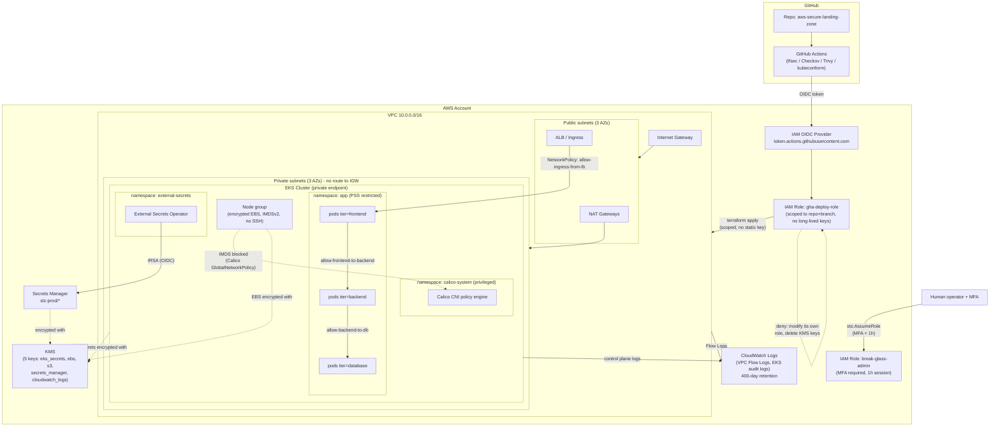

# Architecture

## Overview diagram

## Security choices and rationale

### Network (VPC)
- **Public/private segmentation**: only NAT Gateways and load balancers live in public subnets. EKS nodes and pods have *no route at all* to the Internet Gateway - it's not a security group protecting them, it's the physical absence of a network path.
- **No SSH bastion**: node access goes through AWS SSM Session Manager (IAM-authenticated, logged), never through an exposed port 22. A dedicated NACL explicitly blocks inbound 22/3389 on the private subnets, as defense in depth on top of security groups.
- **VPC Flow Logs** retained for 400 days, KMS-encrypted - needed for any post-incident investigation (who talked to whom, and when).
- **NACLs vs. security groups**: NACLs handle categorical blocking (22/3389 denied regardless of security group), security groups handle fine-grained per-service control. The two layers play different, complementary roles - see the `tfsec:ignore` comments in the code for the detail on wide-port-range NACL rules (stateful return traffic, mandatory for stateless NACLs).

### IAM
- **No `Action: "*"` or `Resource: "*"` for convenience**: every role (EKS cluster, nodes, CI/CD, External Secrets) gets exactly the actions it needs. Where AWS doesn't support ARN-level scoping (e.g. `ec2:Describe*`), that's documented as a native IAM limitation, not a shortcut.
- **Scoped `iam:PassRole`**: the CI/CD policy can only pass the two EKS roles (cluster/node) to `eks.amazonaws.com`/`ec2.amazonaws.com` specifically - this is the control that prevents a compromised pipeline from escalating to a more privileged role.
- **Federated OIDC from GitHub Actions to AWS**: no AWS access key stored as a GitHub secret. The assumed role is scoped to one exact repo and branch (`repo:org/repo:ref:refs/heads/main`), so a PR from a fork can never assume it.
- **Simulated mandatory MFA**: IAM can't force MFA to be enabled on a user via a role's trust policy, but it can refuse to hand out credentials unless the calling STS session was itself established with recent MFA (`aws:MultiFactorAuthPresent` + `aws:MultiFactorAuthAge < 3600`). That's the enforceable, auditable equivalent for role-based access, used on the `break-glass-admin` role.
- **Explicit deny on self-escalation**: the CI/CD role can neither modify its own policy nor delete the KMS keys - a compromised pipeline stays within a bounded blast radius.

### Encryption
- **5 dedicated KMS keys** (EKS secrets, EBS, S3, Secrets Manager, CloudWatch Logs) rather than one shared key - limits blast radius if one key's policy is ever loosened by mistake.
- **Encryption in transit**: TLS for the EKS API server (native), plus `readOnlyRootFilesystem` and secrets that are never inlined in plaintext for workloads.
- **Kubernetes secrets encrypted in etcd** via `encryption_config` on the EKS cluster, on top of EKS's native disk-level encryption.

### Kubernetes / EKS
- **Private API endpoint by default** (`cluster_endpoint_public_access = false`): Terraform manages the cluster through the AWS control-plane API (`eks.<region>.amazonaws.com`), not through the Kubernetes API itself - so `terraform plan/apply` works with no network access to the cluster. `kubectl`/`helm` operations (installing Calico, the External Secrets Operator, applying manifests), on the other hand, need private connectivity: a self-hosted GitHub Actions runner inside the VPC, a VPN, or SSM port-forwarding.
- **"Restricted" Pod Security Standards** applied at the namespace level (`app`, `external-secrets`): `runAsNonRoot`, `allowPrivilegeEscalation: false`, `capabilities.drop: [ALL]`, `seccompProfile: RuntimeDefault`. The `calico-system` namespace stays `privileged` because the CNI legitimately needs `hostNetwork`/`NET_ADMIN` - that's the one documented exception.
- **Namespace-scoped RBAC**: no `ClusterRole` handed out to application teams. A compromised role in `app` can't list or touch anything else in the cluster.
- **"Deny by default" NetworkPolicies**: a `default-deny-all` blocks all traffic in `app`, then targeted rules re-allow DNS, frontend→backend, backend→database, and inbound from the load balancer to the frontend only.
- **Calico GlobalNetworkPolicy** blocking `169.254.169.254` (IMDS) from every pod - the #1 SSRF-to-credential-theft path on EKS, and not expressible with the standard `NetworkPolicy` API (which only targets pods/namespaces, not an external CIDR).
- **Secrets never in plaintext**: the External Secrets Operator syncs from AWS Secrets Manager via IRSA (an IAM role scoped to the exact service account `external-secrets:external-secrets`), with no static access key living in the cluster.

### CI/CD
- **tfsec + Checkov are blocking** on any PR touching `terraform/` - an unjustified `HIGH`/`CRITICAL` finding fails the required check, which blocks the merge via GitHub branch protection.
- **Trivy** scans container images (CVEs) and Kubernetes manifests (misconfiguration) before an image can ever be referenced by a deployment.
- **kubeconform** validates the syntax and schema of Kubernetes manifests.

## Scan results: before / after hardening

Scans run locally with `tfsec v1.28.13` and `checkov v3.3.8` (the same tools used in CI). Full detail in [`docs/scan-results/`](scan-results/).

| | Insecure baseline (`examples/insecure-baseline/`) | Hardened landing zone (`terraform/`) |
|---|---|---|
| **tfsec** | 23 findings: **4 CRITICAL, 11 HIGH**, 5 MEDIUM, 3 LOW (5 passed) | **0 CRITICAL, 0 HIGH** (70 passed, 20 ignored with inline justification) |
| **Checkov** | 38 failed / 12 passed + 1 plaintext secret detected (`CKV_SECRET_6`) | **0 failed** / 194 passed / 7 skips with inline justification |

The baseline reproduces common mistakes (SSH/RDP open to `0.0.0.0/0`, a public S3 bucket, an unencrypted EBS volume, an IAM policy with `Action:"*"`, a hardcoded RDS password) specifically to show, scan output in hand, exactly what the hardened configuration in this repo avoids.

Every remaining exception in the hardened code is an **inline** `tfsec:ignore` / `checkov:skip` **with a technical justification** (visible directly in `terraform/modules/*/main.tf`) rather than a global exclusion hidden in the tool's configuration - the point being that CI stays honest: it blocks everything that hasn't been explicitly reviewed and justified.
