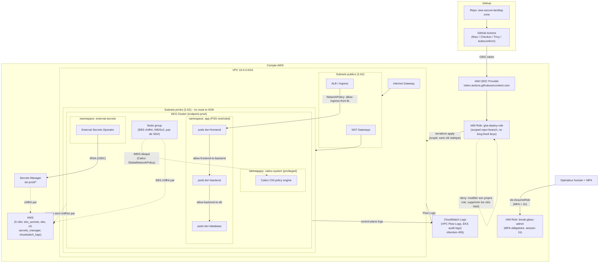

# Architecture

## Schéma d'ensemble

## Choix de sécurité et justifications

### Réseau (VPC)
- **Segmentation publique/privée** : seuls les NAT Gateways et load balancers vivent dans les subnets publics. Les nœuds EKS et les pods n'ont *aucune route* vers l'Internet Gateway - ce n'est pas un security group qui les protège, c'est l'absence physique de chemin réseau.
- **Pas de bastion SSH** : l'accès aux nœuds se fait via AWS SSM Session Manager (authentifié IAM, journalisé), jamais via un port 22 exposé. Un NACL dédié bloque explicitement 22/3389 en entrée sur les subnets privés, en défense en profondeur au-dessus des security groups.
- **VPC Flow Logs** conservés 400 jours, chiffrés KMS - nécessaires pour toute investigation post-incident (qui a parlé à qui, quand).
- **NACL vs Security Groups** : les NACL sont utilisées pour un blocage catégorique (22/3389 refusés quel que soit le security group), les security groups pour le contrôle fin par service. Les deux couches ont des rôles différents et complémentaires - voir les commentaires `tfsec:ignore` dans le code pour le détail des règles NACL avec plage de ports large (retour de trafic avec état, obligatoire pour des NACL sans état).

### IAM
- **Aucun `Action: "*"` ni `Resource: "*"` par confort** : chaque rôle (cluster EKS, nœuds, CI/CD, External Secrets) reçoit exactement les actions nécessaires. Là où AWS n'autorise pas de scoping par ARN (ex. `ec2:Describe*`), c'est documenté comme limitation native d'IAM, pas comme un raccourci.
- **`iam:PassRole` scopé** : la policy CI/CD ne peut passer que les deux rôles EKS (cluster/nœud) à `eks.amazonaws.com`/`ec2.amazonaws.com` précisément - c'est le contrôle qui empêche un pipeline compromis d'escalader vers un rôle plus privilégié.
- **OIDC fédéré GitHub Actions → AWS** : aucune clé d'accès AWS stockée en secret GitHub. Le rôle assumé est scopé à un repo et une branche précis (`repo:org/repo:ref:refs/heads/main`), donc une PR depuis un fork ne peut jamais l'assumer.
- **MFA "obligatoire" simulé** : IAM ne peut pas forcer l'activation du MFA sur un utilisateur via une trust policy de rôle, mais peut refuser d'émettre les credentials tant que la session STS appelante n'a pas elle-même été établie avec MFA récent (`aws:MultiFactorAuthPresent` + `aws:MultiFactorAuthAge < 3600`). C'est l'équivalent applicable et auditable pour un accès par rôle, utilisé sur le rôle `break-glass-admin`.
- **Déni explicite d'auto-escalade** : le rôle CI/CD ne peut ni modifier sa propre policy, ni supprimer les clés KMS - un pipeline compromis reste dans un rayon d'action borné.

### Chiffrement
- **5 clés KMS dédiées** (secrets EKS, EBS, S3, Secrets Manager, CloudWatch Logs) plutôt qu'une clé partagée - limite le rayon d'impact si la policy d'une clé est un jour élargie par erreur.
- **Chiffrement en transit** : TLS pour l'API server EKS (natif), et readOnlyRootFilesystem + secrets jamais en clair pour les workloads.
- **Secrets Kubernetes chiffrés dans etcd** via `encryption_config` sur le cluster EKS, en plus du chiffrement disque natif d'EKS.

### Kubernetes / EKS
- **Endpoint API privé par défaut** (`cluster_endpoint_public_access = false`) : Terraform gère le cluster via l'API de contrôle AWS (`eks.<region>.amazonaws.com`), pas via l'API Kubernetes elle-même - donc `terraform plan/apply` fonctionne sans accès réseau au cluster. Les opérations `kubectl`/`helm` (installation de Calico, de l'External Secrets Operator, application des manifests) nécessitent en revanche une connectivité privée : runner GitHub Actions auto-hébergé dans le VPC, VPN, ou SSM port-forwarding.
- **Pod Security Standards "restricted"** appliqué au niveau namespace (`app`, `external-secrets`) : `runAsNonRoot`, `allowPrivilegeEscalation: false`, `capabilities.drop: [ALL]`, `seccompProfile: RuntimeDefault`. Le namespace `calico-system` reste en `privileged` car le CNI a légitimement besoin de `hostNetwork`/`NET_ADMIN` - c'est la seule exception, documentée.
- **RBAC namespace-scopé** : aucun `ClusterRole` distribué aux équipes applicatives. Un rôle compromis dans `app` ne peut rien lister ni modifier ailleurs dans le cluster.
- **NetworkPolicies "deny by default"** : un `default-deny-all` bloque tout le trafic dans `app`, puis des règles ciblées ré-autorisent DNS, frontend→backend, backend→database, et l'entrée depuis le load balancer uniquement vers le frontend.
- **Calico GlobalNetworkPolicy** pour bloquer `169.254.169.254` (IMDS) depuis tous les pods - la voie n°1 d'escalade SSRF→vol de credentials sur EKS, non exprimable avec l'API `NetworkPolicy` standard (qui ne cible que des pods/namespaces, pas un CIDR externe).
- **Secrets jamais en clair** : l'External Secrets Operator synchronise depuis AWS Secrets Manager via IRSA (rôle IAM scopé au service account exact `external-secrets:external-secrets`), sans clé d'accès statique dans le cluster.

### CI/CD
- **tfsec + Checkov bloquants** sur toute PR touchant `terraform/` - un `HIGH`/`CRITICAL` non justifié fait échouer le check requis, ce qui bloque la fusion via la protection de branche GitHub.
- **Trivy** scanne les images de conteneurs (CVE) et les manifests Kubernetes (mauvaise configuration) avant qu'une image ne puisse être référencée par un déploiement.
- **kubeconform** valide la syntaxe et le schéma des manifests Kubernetes.

## Résultats des scans avant/après durcissement

Scans exécutés localement avec `tfsec v1.28.13` et `checkov v3.3.8` (mêmes outils que la CI). Détail complet dans [`docs/scan-results/`](scan-results/).

| | Baseline non sécurisée (`examples/insecure-baseline/`) | Landing zone durcie (`terraform/`) |
|---|---|---|
| **tfsec** | 23 findings : **4 CRITICAL, 11 HIGH**, 5 MEDIUM, 3 LOW (5 passed) | **0 CRITICAL, 0 HIGH** (70 passed, 20 ignorés et justifiés en ligne) |
| **Checkov** | 38 failed / 12 passed + 1 secret en clair détecté (`CKV_SECRET_6`) | **0 failed** / 194 passed / 7 skips justifiés en ligne |

La baseline reproduit des erreurs courantes (SSH/RDP ouverts à `0.0.0.0/0`, bucket S3 public, EBS non chiffré, policy IAM `Action:"*"`, mot de passe RDS en dur) précisément pour illustrer, scan à l'appui, ce que la configuration durcie de ce repo évite.

Chaque exception restante dans le code durci est un `tfsec:ignore` / `checkov:skip` **en ligne, avec justification technique** (visible directement dans `terraform/modules/*/main.tf`) plutôt qu'une exclusion globale masquée dans la configuration de l'outil - le but étant que la CI reste honnête : elle bloque tout ce qui n'a pas été explicitement examiné et justifié.
