# 1. Executive Summary

This document is a complete technical reference for the **AWS Secure Landing Zone** project (repository: `aws-secure-landing-zone`). It goes beyond the README: it explains **why** every resource exists, what threat or requirement it addresses, what alternatives were considered, and what a reviewer or interviewer is likely to ask about it.

The project delivers Infrastructure-as-Code for a security-first AWS landing zone: a segmented VPC, a least-privilege IAM model, centralized KMS encryption, a hardened EKS cluster, a Kubernetes security layer (Pod Security Standards, RBAC, NetworkPolicies, secret management), and a CI/CD pipeline that fails a pull request when it introduces a vulnerability. Every claim in this document ("0 CRITICAL findings", "no wildcard IAM actions", etc.) is backed by a command you can re-run yourself — none of it is asserted without evidence.

**What this project demonstrates to an employer**: the ability to design cloud infrastructure with security controls built in from the start (not bolted on after an audit), to reason about AWS's IAM permission model precisely enough to write policies with zero unnecessary wildcards, to harden a Kubernetes cluster across every layer (network, identity, admission, secrets), and to wire security scanning into CI/CD so that it actually blocks bad changes rather than just reporting on them.

**What this project does not do**: it has not been deployed to a real AWS account. Every Terraform module passes `terraform validate` and is scanned with the same tools the CI pipeline uses (`tfsec`, `checkov`), but no `terraform apply` has been run. This is a deliberate scope decision, not an oversight — deploying would create billable resources (NAT Gateways, EKS control plane, KMS keys) with no workload behind them, which is a poor use of budget for a portfolio piece. If you get asked "did you actually run this?", the honest answer is: "validated and scanned, not deployed — and here's exactly why."

---

# 2. Why This Project, and Why This Design

Cloud security roles in 2026 (particularly at ESN/consultancies and large accounts in France and the EU) increasingly expect candidates to show, not tell: a GitHub repo with real Terraform, real scan output, and a README that explains trade-offs beats a certification list. This project was scoped specifically to hit the intersection of three skill areas that are usually taught and demonstrated separately:

1. **Infrastructure as Code** (Terraform: modules, state, variables, validation)
2. **Cloud Security Posture Management** (the discipline of designing IAM/network/encryption so that misconfiguration is structurally hard, and of using tools like tfsec/Checkov to catch what slips through)
3. **Kubernetes hardening** (Pod Security Standards, NetworkPolicies, RBAC, secret management — the parts of Kubernetes that are optional by default and therefore the parts that get skipped under deadline pressure)

The unifying design principle across the whole repo is: **every security control has a one-sentence justification tied to a specific threat**, and **every exception to a security rule is documented inline in the code, not swept under a global ignore list**. That second point is deliberately over-engineered relative to what a real fast-moving team might do — it exists here because it makes the *reasoning* visible, which is the point of a portfolio piece.

---

# 3. Threat Model (What This Design Defends Against)

Being explicit about the threat model is what separates "I added encryption because the checklist said to" from "I understand what encryption in this specific spot prevents." The threats this landing zone is designed around:

| Threat | Primary mitigation | Where in the repo |
|---|---|---|
| Internet-facing SSH/RDP compromise of a node | No route from private subnets to the Internet Gateway; NACL explicitly denies 22/3389 inbound; node access via SSM Session Manager only | `terraform/modules/vpc/main.tf`, `terraform/modules/eks/main.tf` |
| Compromised CI/CD pipeline used to pivot into full AWS admin | `iam:PassRole` scoped to exactly two role ARNs with a `PassedToService` condition; explicit deny on modifying its own policy or deleting KMS keys | `terraform/modules/iam/main.tf` (`github_actions_deploy` policy) |
| Long-lived AWS credentials leaked from GitHub Actions secrets | No static AWS keys at all — OIDC federation, short-lived STS session, trust scoped to one repo+branch | `terraform/modules/iam/main.tf` (`aws_iam_openid_connect_provider.github_actions`) |
| A compromised pod using SSRF to reach the EC2 metadata service and steal node/instance credentials | Calico `GlobalNetworkPolicy` blocking `169.254.169.254` from every pod cluster-wide, independent of namespace-level NetworkPolicies | `kubernetes/network-policies/calico-deny-imds.yaml` |
| A compromised pod moving laterally to another tier (e.g. frontend → database) | Deny-by-default `NetworkPolicy` in the `app` namespace; only frontend→backend and backend→database are explicitly allowed | `kubernetes/network-policies/` |
| A developer's kubectl context accidentally touching cluster-wide resources | Namespace-scoped `Role`/`RoleBinding` only — no `ClusterRole` handed to application teams | `kubernetes/rbac/` |
| Secrets committed to Git, or stored in plaintext in a Kubernetes manifest | External Secrets Operator pulls from AWS Secrets Manager at runtime via IRSA; no `Secret` object is ever hand-authored with a value in it | `kubernetes/external-secrets/` |
| An attacker who compromises a human operator's laptop session using a stale/cached credential | Break-glass admin role requires `aws:MultiFactorAuthPresent=true` AND `aws:MultiFactorAuthAge < 3600` in the trust policy | `terraform/modules/iam/main.tf` (`break_glass_admin`) |
| Vulnerable base images or CVEs shipped to production | Trivy scans images in CI and fails the build on CRITICAL/HIGH with an available fix | `.github/workflows/image-scan-trivy.yml` |
| Infrastructure drift that reintroduces a fixed vulnerability | tfsec + Checkov run on every PR touching `terraform/`, required check in branch protection | `.github/workflows/terraform-security-scan.yml` |
| Post-incident investigation with no evidence trail | VPC Flow Logs + EKS control plane audit logs, both KMS-encrypted, retained 400 days | `terraform/modules/vpc/main.tf`, `terraform/modules/eks/main.tf` |

---

# 4. Architecture Diagrams

## 4.1 Network and Kubernetes topology

{ width=100% }

Inside the VPC, the only path from the internet to a workload is Internet Gateway → public subnet (NAT/ALB) → private subnet (EKS nodes) — there is no other route in. Pods are additionally isolated from each other by NetworkPolicies at the Kubernetes layer (frontend → backend → database, nothing else), on top of the security groups at the EC2 layer. Every dotted arrow that touches KMS represents data encrypted at rest with a key dedicated to that data category, not a single shared key.

## 4.2 CI/CD trust flow and break-glass access

{ width=85% }

GitHub Actions never holds an AWS credential at rest. It exchanges a short-lived OIDC token — minted fresh by GitHub on every workflow run — for an STS session scoped to `gha-deploy-role`, which is itself denied the ability to touch its own policy or destroy the KMS keys/audit trail. The break-glass admin path is deliberately separate and rarely used: a human operator can only assume it with a currently-valid MFA session, never from an automated pipeline.

---

# 5. Terraform Module Deep Dive

## 5.1 `terraform/modules/vpc`

**Purpose**: network segmentation and the traffic-visibility layer.

**Resources and reasoning**:

- `aws_vpc.this` — a single VPC per environment, `10.0.0.0/16` by default (65,536 addresses — generous headroom for multiple EKS node groups and future subnets without needing to re-CIDR).
- `aws_default_security_group.this` — **the VPC's default security group is explicitly captured and left with zero rules.** AWS creates a default security group automatically with a permissive same-SG-ingress rule; if anything is ever accidentally launched without an explicit security group, this ensures it gets *no* network access rather than implicit trust. This is a common audit finding (`CKV2_AWS_12` in Checkov) and a one-resource fix.
- Public subnets (`aws_subnet.public`, one per AZ) host **only** NAT Gateways and load balancers. `map_public_ip_on_launch = false` — even in a public subnet, an ENI does not get a public IP by default; it must be requested explicitly (as the NAT Gateway's EIP is). This prevents an accidental `aws_instance` in this subnet from becoming internet-reachable by default.
- Private subnets (`aws_subnet.private`) host EKS nodes and pods. **There is no route to the Internet Gateway from these subnets at all** — traffic to the internet must go through a NAT Gateway. This is stronger than "a security group blocks inbound" because there's no *routing path* for an external actor to reach these subnets directly, independent of any security group misconfiguration.
- `aws_nat_gateway` — one per AZ by default (`single_nat_gateway = false`), for availability: if one AZ's NAT Gateway or its EIP has an issue, the other AZs' private subnets are unaffected. The trade-off is cost (~3x a single NAT Gateway) and it's exposed as a variable specifically so a cost-sensitive deployment (e.g. a dev/staging environment) can flip it.
- `aws_flow_log` + `aws_cloudwatch_log_group.flow_logs` — **VPC Flow Logs, `traffic_type = "ALL"`** (accepted and rejected connections, not just accepted), encrypted with the `cloudwatch_logs` KMS key, retained 400 days. This is the network forensics layer: without it, "what talked to what and when" is unanswerable after the fact.
- `aws_network_acl.private` — a defense-in-depth layer *on top of* security groups. NACLs are stateless (they don't track connection state the way security groups do), which is why:
  - Rule 90/91 **explicitly deny** inbound 22/3389 from `0.0.0.0/0` — this is the "no direct SSH from the internet" requirement made structural rather than convention. Even if someone loosens a security group by mistake, this NACL rule still blocks it.
  - Rule 100 (inbound) allows all ports from the VPC CIDR only — needed for node-to-node and node-to-control-plane traffic; fine-grained port control is left to security groups.
  - Rule 110 (inbound) allows TCP 1024–65535 from `0.0.0.0/0` — this looks alarming out of context but is the **stateless-NACL return-traffic rule**: because NACLs don't track connection state, a response to a connection *this subnet initiated outbound* (e.g., a node calling an AWS API through the NAT Gateway) comes back on an arbitrary ephemeral port from an arbitrary source IP, and without this rule that return traffic would be silently dropped. It cannot be used to *initiate* an inbound connection because nothing in these subnets listens on those ports, and rules 90/91 (lower rule number → evaluated first) already deny the two ports that matter (22, 3389).
  - Rule 100 (outbound) allows all - matches the fact that all outbound traffic already funnels through a single NAT Gateway; enumerating destination ports here has no security benefit and would require hand-maintaining a port list for every AWS API and package registry the cluster talks to.
- IAM role `flow_logs` — scoped to `logs:CreateLogStream`/`PutLogEvents`/`Describe*` on **this one log group's ARN** (with the AWS-documented `:*` suffix for log streams within it), not `Resource: "*"`.

**tfsec/Checkov findings intentionally accepted here** (with inline justification comments at each resource): the two "ALL ports" NACL rules and the ephemeral-port ingress rule, for the reasons above. Nothing in this module accepts a finding about ingress from the internet to a *workload* port.

## 5.2 `terraform/modules/kms`

**Purpose**: encryption at rest, with blast-radius containment.

**Design decision — 5 keys, not 1**: `eks_secrets`, `ebs`, `s3`, `secrets_manager`, `cloudwatch_logs`. The alternative (one shared "landing zone" key) is simpler to manage but means a single over-permissive key policy compromises every data category at once. Splitting by data domain means, for example, that a bug in the CloudWatch Logs key's policy doesn't affect the ability to decrypt EBS volumes or Secrets Manager entries. `enable_key_rotation = true` on every key (annual automatic rotation, AWS-managed).

**Key policy**: two statements — root account admin (AWS best practice: never let an IAM policy alone be the only path to a key, or a mistake in IAM can permanently orphan the key with no way to fix it) and a named list of key-admin role ARNs (the break-glass admin role plus any explicitly configured human operators). No `Principal: "*"`.

## 5.3 `terraform/modules/iam`

**Purpose**: this is the module doing the most "prove you actually understand IAM" work in the repo, and the one worth rehearsing an explanation of before an interview.

**Roles created**:

1. **`eks_cluster`** — trust: `eks.amazonaws.com` only. Permissions: `AmazonEKSClusterPolicy` (the one AWS-managed policy EKS requires). No hand-written policy attached, because there's nothing to add — the managed policy is already minimal for what the control plane itself needs.

2. **`eks_node`** — trust: `ec2.amazonaws.com` only. Permissions: exactly the three managed policies worker nodes need (`AmazonEKSWorkerNodePolicy`, `AmazonEKS_CNI_Policy`, `AmazonEC2ContainerRegistryReadOnly`). No S3, no RDS, no anything else — a compromised node's IAM identity can join the cluster, run the VPC CNI, and pull images. Nothing more.

3. **`github_actions_deploy`** — this is the interesting one. Trust is federated OIDC (`aws_iam_openid_connect_provider.github_actions`, pointed at `token.actions.githubusercontent.com`), with the trust policy's `Condition` restricting `sub` to `repo:<org>/<repo>:ref:refs/heads/main` — meaning a workflow run on a fork, or on any branch other than `main`, cannot assume this role even with a valid OIDC token from GitHub, because the token's `sub` claim won't match. **This is what "no static AWS keys stored as GitHub secrets" means in practice**: the workflow calls `sts:AssumeRoleWithWebIdentity` with a token GitHub itself mints per-run, and AWS validates that token against the OIDC provider's thumbprint before ever issuing temporary credentials.

   The permission policy attached to this role is where the "no wildcards" claim gets tested hardest, and is worth walking through statement by statement (see `terraform/modules/iam/main.tf`, resource `github_actions_deploy`):
   - `ReadOnlyDescribeUnavoidablyUnscoped` — `ec2:Describe*`, `eks:Describe*`, etc. on `Resource: "*"`. This is **not** a shortcut: AWS's IAM model does not support resource-level permissions for most `Describe`/`List` calls on these services (documented in the IAM User Guide's per-service "Resource-level permissions" reference). There is no ARN you could put here that would be more specific and still work.
   - `ManageVpcNetworking` — a curated list of ~30 specific `ec2:Create*`/`Delete*`/`Modify*`/`Authorize*` actions (not `ec2:*`), still on `Resource: "*"` because EC2 networking resources (VPCs, subnets, security groups, NACLs) largely don't support resource-level ARN scoping in IAM either — but the **action list itself** is exhaustively enumerated rather than wildcarded, and scoped further by a `aws:RequestedRegion` condition.
   - `ManageEksResources` — scoped to `arn:aws:eks:*:<account>:cluster/<name_prefix>-*` and the matching nodegroup ARN pattern. EKS *does* support resource-level ARNs, so this statement uses them.
   - `ManageLogGroups` — scoped to `arn:aws:logs:*:<account>:log-group:*<name_prefix>*`.
   - `ManageProjectIamResources` — scoped to `arn:aws:iam::<account>:role/<name_prefix>-*` and the matching `policy/` pattern. The deploy role can create/attach/tag IAM resources this project owns, and nothing named outside that prefix.
   - **`PassLandingZoneRolesToAwsServices`** — this is the statement worth highlighting in an interview, because it's the one most real-world IAM policies get wrong. `iam:PassRole` is what lets Terraform hand the `eks_cluster`/`eks_node` role ARNs to the EKS/EC2 services when creating the cluster and node group. An overly broad `iam:PassRole: Resource: "*"` is one of the most common real-world privilege-escalation primitives (pass an admin role to a Lambda/EC2 instance you control, then use that compute to assume it). Here, the statement is scoped to **exactly the two role ARNs this project created**, further gated by `Condition: {"iam:PassedToService": ["eks.amazonaws.com", "ec2.amazonaws.com"]}` — so even if an attacker fully controlled this CI role, they could not pass, say, the break-glass admin role to an EC2 instance to escalate.
   - `CreateProjectKmsKeys` / `ManageExistingProjectKmsKeys` — split into two statements deliberately. `kms:CreateKey` cannot be scoped to a resource ARN (the key doesn't exist yet), so it's isolated in its own statement with no condition. Every *subsequent* action on an existing key (`PutKeyPolicy`, `ScheduleKeyDeletion`, `TagResource`, etc.) is gated by an **ABAC condition**: `"aws:ResourceTag/Project": "secure-landing-zone"`. This is attribute-based access control — the policy doesn't know the key's ARN ahead of time, but it only lets these actions succeed on keys that carry this project's tag, so a KMS key belonging to an unrelated workload in the same account is untouched even though the action list is broad.
   - `TerraformStateBackend` / `TerraformStateLock` — scoped to the exact S3 state bucket and DynamoDB lock table ARNs (passed in as variables), not `s3:*`/`dynamodb:*`.
   - `DenySelfPrivilegeEscalation` / `DenyKeyAndAuditDestruction` — explicit `Deny` statements (which always win over an `Allow` in IAM policy evaluation) preventing this role from modifying its own policy or deleting the KMS keys/stopping CloudTrail, so that even a fully compromised pipeline identity has a bounded blast radius.

4. **`break_glass_admin`** — the answer to "MFA obligatoire simulée" (simulated mandatory MFA) from the brief. IAM cannot force a user to *have* MFA enrolled from within a role's trust policy — that's an IAM user/account-level setting, not something a role can inspect. What a trust policy *can* do is refuse to hand out session credentials unless the caller's *current* STS session already carries proof of a recent MFA check: `Condition: {"Bool": {"aws:MultiFactorAuthPresent": "true"}, "NumericLessThan": {"aws:MultiFactorAuthAge": "3600"}}`. That's the enforceable, auditable equivalent for role-based access — and it's the honest answer to give if asked "how do you actually simulate MFA in IaC" (you don't simulate MFA itself; you enforce that only a session which has already passed MFA gets in). `AdministratorAccess` is attached to this role deliberately (it is a break-glass role, not a day-to-day one) — the Checkov finding this triggers (`CKV_AWS_274`) is suppressed inline with a comment explaining exactly why, rather than globally ignored.

**Why this level of IAM detail matters for an interview**: most candidates can say "I used least privilege." Being able to explain *why* `Resource: "*"` appears on three specific statements, and why that's an AWS platform limitation rather than laziness, is what separates "read about IAM" from "wrote IAM policies that had to actually work."

## 5.4 `terraform/modules/eks`

**Purpose**: the Kubernetes control plane and compute layer.

- `cluster_endpoint_public_access = false` **by default** — this is a deliberate hardening choice beyond what the brief literally required. The reasoning: Terraform manages the `aws_eks_cluster` resource through AWS's regular control-plane API (`eks.<region>.amazonaws.com`), which is a different endpoint from the cluster's own Kubernetes API server. So `terraform plan`/`apply` works with **zero network access to the cluster itself**, even with the K8s API endpoint fully private. Only `kubectl`/`helm`-level operations (installing Calico, the External Secrets Operator, applying manifests) need reachability to the K8s API, and those are documented as requiring a self-hosted runner inside the VPC, a VPN, or SSM port-forwarding. If you ever do need public access for operational reasons, `cluster_endpoint_public_access_cidrs` has a `validation` block that hard-fails `terraform plan` if it contains `0.0.0.0/0`.
- `encryption_config { resources = ["secrets"] }` on the cluster — envelope-encrypts Kubernetes `Secret` objects in etcd with the `eks_secrets` KMS key, on top of EKS's own at-rest disk encryption. Without this, anyone with `etcd` snapshot access (a much lower bar than the K8s API) could read secret values.
- `enabled_cluster_log_types = ["api", "audit", "authenticator", "controllerManager", "scheduler"]` — all five log streams, not just `audit`. `authenticator` specifically is what lets you answer "who authenticated as what IAM identity and were they mapped to which Kubernetes user" after an incident.
- Security groups: control plane and node SGs allow only the minimum cross-talk (443 from nodes to control plane, ephemeral ports from control plane to node kubelets, node-to-node). Egress is `0.0.0.0/0` on both — accepted and documented inline (`tfsec:ignore`/`checkov:skip` comments) because both SGs are attached to ENIs that live exclusively in private subnets with no IGW route, so this traffic is NAT-gated regardless of the security group rule, and AWS's API/registry IP ranges are too broad to enumerate as a static allow-list without constant maintenance.
- `aws_launch_template.nodes` — `http_tokens = "required"` (**IMDSv2 only**, no fallback to the older unauthenticated IMDSv1), `http_put_response_hop_limit = 1` (prevents a containerized workload from reaching the instance metadata service through an extra network hop, which matters if a pod's traffic could otherwise be routed through the host), EBS `encrypted = true` with the dedicated `ebs` KMS key, `associate_public_ip_address = false`.
- IRSA (`aws_iam_openid_connect_provider.eks`, fingerprint pulled live via `data.tls_certificate`) — the mechanism that lets individual pods assume narrowly-scoped IAM roles instead of inheriting the node's IAM role. Used concretely by the External Secrets Operator (see §6.4).

## 5.5 `terraform/environments/prod`

Wires the four modules together, plus one resource that can't live in either `iam` or `eks` without creating a circular module dependency: the IRSA role for the External Secrets Operator, which needs *both* the EKS module's OIDC provider ARN and the IAM module's permission policy ARN. Its trust policy is scoped with `StringEquals` conditions on both `sub` (`system:serviceaccount:external-secrets:external-secrets` — the *exact* namespace:serviceaccount pair, not a wildcard) and `aud` (`sts.amazonaws.com`).

---

# 6. Kubernetes Security Layer Deep Dive

## 6.1 Pod Security Standards (`kubernetes/namespaces.yaml`)

Kubernetes' built-in Pod Security Admission controller enforces one of three built-in profiles per namespace via labels — no extra operator needed. The `app` and `external-secrets` namespaces are labeled `restricted` (the strictest tier: no root, no privilege escalation, mandatory `seccompProfile`, all Linux capabilities dropped by default, no `hostPath`/`hostNetwork`/`hostPID`). `enforce`, `audit`, and `warn` are all set to `restricted` — `enforce` rejects non-compliant pods outright, `audit`/`warn` make violations visible in the API server audit log and in `kubectl` output even for things the enforce level already blocked, which matters when debugging why a manifest was rejected. `calico-system` is deliberately left at `privileged` — the CNI needs `hostNetwork`/`NET_ADMIN` to function, and this is documented as the one accepted exception rather than silently excluded.

## 6.2 NetworkPolicies (`kubernetes/network-policies/`)

The design is **deny-by-default, allow-by-exception** — `default-deny-all.yaml` uses an empty `podSelector: {}` with both `Ingress` and `Egress` in `policyTypes`, which blocks *all* traffic to and from every pod in the `app` namespace, including same-namespace and DNS traffic. Everything else in the directory is a narrow, additive exception:

- `allow-dns-egress.yaml` — without this, every pod fails to resolve *anything*, including its own dependencies, because default-deny also blocks the CoreDNS lookup.
- `allow-frontend-to-backend.yaml` / `allow-backend-to-db.yaml` — segmentation by pod label (`tier: frontend/backend/database`) within the same namespace, not just namespace-level isolation. A compromised frontend pod has no network path to the database tier at all — not "was denied by a policy that could theoretically be misconfigured," but "there is no rule anywhere granting that path."
- `allow-ingress-from-lb.yaml` — only the frontend tier accepts traffic originating outside the pod network.
- `calico-deny-imds.yaml` — a Calico `GlobalNetworkPolicy` (not the standard `NetworkPolicy` API), because the standard API can only select pods/namespaces, not an arbitrary external CIDR. This blocks every pod cluster-wide from reaching `169.254.169.254` (instance metadata) — closing the most common SSRF-to-credential-theft path on EKS, independent of whichever namespace-level policy is or isn't applied to a given workload.

## 6.3 RBAC (`kubernetes/rbac/`)

`Role`/`RoleBinding` only — **no `ClusterRole` is granted to application teams anywhere in this repo.** `app-developer` gets create/update on Deployments/Services/ConfigMaps and read-only on Pods/logs, but explicitly *not* `exec`/`attach`/`port-forward` into running pods (shipping manifests is not the same permission as getting a shell in production) and explicitly *not* access to `secrets` (those are exclusively managed by the External Secrets Operator's own namespace-scoped role). `RoleBinding`s target IAM-mapped **groups** (`app-developers`, `app-readonly`) rather than individually named users, so onboarding/offboarding is a group-membership change in AWS, not a manifest edit.

## 6.4 Secrets: External Secrets Operator + IRSA (`kubernetes/external-secrets/`)

The chain, end to end: the `external-secrets` ServiceAccount is annotated with the IRSA role ARN (`eks.amazonaws.com/role-arn`) created in `terraform/environments/prod/main.tf`. That role's IAM policy allows exactly `secretsmanager:GetSecretValue`/`DescribeSecret` on `arn:aws:secretsmanager:*:<account>:secret:<name_prefix>/*` — this project's secrets only. A `ClusterSecretStore` points the operator at AWS Secrets Manager, authenticating via that service account (no static AWS key anywhere in the cluster). An `ExternalSecret` object declares "namespace `app` needs a `Secret` called `db-credentials`, sourced from Secrets Manager key `slz-prod/app/db-credentials`" — the operator polls and reconciles the actual `Secret` object automatically, including on rotation. **The secret's value never appears in this Git repository, in any manifest, or in shell history from an `kubectl apply`.**

## 6.5 Reference hardened Deployment (`kubernetes/pod-security/hardened-deployment-example.yaml`)

Included specifically so the abstract Pod Security Standard requirements have a concrete, copy-pasteable example: `runAsNonRoot: true`, explicit non-root UID/GID, `seccompProfile: RuntimeDefault`, `allowPrivilegeEscalation: false`, `readOnlyRootFilesystem: true` (with an `emptyDir` mounted at `/tmp` for the scratch space a read-only root still needs), `capabilities.drop: ["ALL"]`, `automountServiceAccountToken: false` on a service account with no IAM role annotation (this specific workload has no reason to talk to AWS APIs, so it gets no AWS identity at all — not even the node's).

---

# 7. CI/CD Pipeline Deep Dive

## 7.1 `.github/workflows/terraform-security-scan.yml`

Triggered on any PR touching `terraform/`, plus post-merge on `main`. Four jobs: `terraform fmt -check` + `terraform validate` per module/environment; `tfsec` (`soft_fail: false` — a HIGH/CRITICAL finding fails the job, not just reports it); `checkov` (same, plus SARIF upload to GitHub's Security tab so findings show up natively in the PR's "Security" view, not just in workflow logs); `kubeconform` for Kubernetes manifest schema validation (`-ignore-missing-schemas` specifically scoped to the two custom-resource APIs this repo uses — Calico and External Secrets — so built-in Kubernetes types are still validated strictly). Because tfsec/Checkov's inline `ignore`/`skip` comments are respected by the tools themselves, a documented exception doesn't fail the build, but an *undocumented* one does — this is what makes "blocks the merge if a vulnerability is found" actually true rather than aspirational.

## 7.2 `.github/workflows/terraform-plan.yml`

Demonstrates the OIDC federation end-to-end: `aws-actions/configure-aws-credentials` exchanges the workflow's OIDC token for a session under `github_actions_deploy_role_arn` (no `AWS_ACCESS_KEY_ID` secret anywhere in the repo settings), then runs `terraform plan` against the `prod` environment. Deliberately plan-only — apply is treated as a separate, manually-approved step, not something a PR triggers automatically.

## 7.3 `.github/workflows/image-scan-trivy.yml`

Builds the application image (once one exists in this repo — the workflow is path-triggered on `Dockerfile`/`src/**`, so it's inert until app code is added) and scans it with Trivy, `exit-code: 1` on CRITICAL/HIGH with an available fix (`ignore-unfixed: true` — no point blocking a merge over a CVE with no patch to apply). A second non-blocking scan uploads a SARIF report for the Security tab, and a separate step scans the `kubernetes/` manifests themselves for misconfiguration with Trivy's config scanner.

---

# 8. Scan Methodology and Result Interpretation

Two scans were run for the "before/after" comparison the brief asked for, using the exact tool versions the CI pipeline uses (`tfsec v1.28.13`, `checkov v3.3.8`):

- **Before**: `examples/insecure-baseline/main.tf` — a deliberately broken Terraform file (SSH/RDP open to `0.0.0.0/0`, a public S3 bucket, an unencrypted EBS volume, an IAM policy with `Action: "*", Resource: "*"`, a hardcoded RDS password). This file is **not part of the deployable landing zone** — it exists solely to give the scanners something realistically bad to catch, so the "after" numbers mean something.
- **After**: the actual `terraform/` tree.

| Metric | Before | After |
|---|---|---|
| tfsec CRITICAL | 4 | 0 |
| tfsec HIGH | 11 | 0 |
| tfsec passed checks | 5 | 70 (+ 20 inline-justified ignores) |
| Checkov failed | 38 | 0 |
| Checkov passed | 12 | 194 |
| Checkov secrets scan | 1 hardcoded credential detected | — |

Raw tool output for both runs is committed under `docs/scan-results/{before,after}/` — not summarized or hand-edited, so the numbers above can be independently re-verified by opening those files or re-running the scanners locally (`tfsec terraform/`, `checkov -d terraform/`).

**The one point worth making explicit in an interview**: 0 findings is not the same as "0 accepted risk." The hardened tree still has 20 tfsec-ignored and 7 checkov-skipped items — every one of them is a real finding that a scanner correctly flagged, reviewed individually, and either judged to be an AWS platform limitation (can't be scoped further) or a deliberate, bounded trade-off (e.g. the break-glass role's `AdministratorAccess`). The scanner's job is to force that review to happen, not to reach zero by hiding things.

---

# 9. Deployment Runbook (What Actually Applying This Would Involve)

1. **Bootstrap the Terraform backend** (outside this repo's Terraform, since a backend can't be created by the config that uses it): an S3 bucket with versioning and encryption enabled, and a DynamoDB table for state locking.
2. **Configure `terraform/environments/prod/backend.tf`** with the real bucket/table names, and `terraform.tfvars` (from the `.example` file) with the real account ID, GitHub org/repo, and — critically — `human_admin_principal_arns` and `cluster_endpoint_public_access_cidrs` (if public access is ever turned on).
3. `terraform init && terraform plan && terraform apply` — creates the VPC, KMS keys, IAM roles, and EKS cluster/node group. Expect this to take 15-20 minutes, mostly EKS control plane provisioning.
4. **Establish private connectivity** to the now-private EKS API endpoint: a VPN, SSM port-forwarding session, or a self-hosted GitHub Actions runner deployed inside the VPC (this is a real operational decision a team has to make, not a detail to hand-wave).
5. `aws eks update-kubeconfig`, then `kubectl apply -f kubernetes/namespaces.yaml`, `kubernetes/rbac/`, `kubernetes/network-policies/` (the Calico `GlobalNetworkPolicy` specifically requires Calico's CRDs to already be installed as the policy engine — via Helm, alongside the AWS VPC CNI which continues to handle IP address management).
6. Install the External Secrets Operator via Helm, then `kubectl apply -f kubernetes/external-secrets/` (after replacing the placeholder role ARN in `service-accounts.yaml` with the real Terraform output).
7. Push a workload; confirm the `terraform-plan.yml`/`terraform-security-scan.yml`/`image-scan-trivy.yml` workflows are wired to branch protection as required checks.

---

# 10. Known Limitations and What Production Would Add

Being upfront about these is more credible than pretending the repo is a finished product:

- **Egress from the EKS security groups is `0.0.0.0/0`**, NAT-gated but not restricted to AWS service IP prefix lists. A production rollout with a lower risk tolerance would add an egress-filtering proxy or scope security group egress to AWS-managed prefix lists (`com.amazonaws.<region>.s3`, etc.) plus specific registry IPs — deliberately out of scope here as a "further hardening" line item rather than attempted and half-done.
- **No WAF / no DDoS protection layer** (Shield/WAF) in front of the ALB — the brief's scope was the landing zone and cluster, not the application edge.
- **No automated node/AMI patching pipeline** — the node group uses a launch template but there's no Karpenter/managed-node-group auto-upgrade workflow wired up.
- **Single-region** — no cross-region DR story.
- **The CI/CD deploy role's `ManageVpcNetworking`/read-only statements use `Resource: "*"`** where AWS's IAM model requires it (documented in §5.3) — a production environment with stricter compliance requirements (e.g. PCI-DSS scope) might additionally use a permissions boundary or SCP at the AWS Organizations level to cap this role regardless of what its own policy says, as a second independent layer.

---

# 11. Anticipated Interview Questions

**"Why not just use one IAM policy with `AdministratorAccess` for CI and rely on human review of every PR?"**
Because that makes every PR's blast radius equal to full account compromise if the pipeline itself is ever compromised (a dependency confusion attack on a GitHub Action, a leaked runner, etc.) — the goal of scoping the deploy role is that *even if* the pipeline is compromised, the attacker's reach is bounded to what this landing zone touches, and specifically excludes self-modification and audit-trail destruction.

**"Why five KMS keys instead of one?"**
Blast radius. A key policy is the kind of thing that gets loosened under pressure ("just add this principal so the new service can decrypt"); splitting by data domain means that mistake affects one category of data, not everything encrypted in the account.

**"You said EKS is private by default — doesn't that make the pipeline useless?"**
No — Terraform talks to the EKS *control-plane API* (`eks.<region>.amazonaws.com`), which is always reachable from GitHub-hosted runners regardless of the cluster's own API server visibility. Only `kubectl`/`helm` need cluster-network reachability, and that's a separate, explicitly documented requirement (VPN/SSM/self-hosted runner).

**"What would you change if this had to pass a PCI-DSS or ISO 27001 audit?"**
Add a permissions boundary/SCP as a second independent cap on the CI role, restrict security group egress to AWS prefix lists instead of `0.0.0.0/0`, extend log retention past 400 days per the specific standard's requirement, and formalize the break-glass role's usage into a documented incident-response runbook with required post-use review (the technical control exists; the process wrapper around it doesn't yet).

**"How did you validate any of this without deploying it?"**
`terraform validate` catches syntax/reference errors and type mismatches across all four modules and the root environment. `tfsec`/`checkov` are static analyzers that parse the HCL directly — they don't need a deployed cluster to catch "this security group allows 0.0.0.0/0 on port 22." `kubeconform` validates Kubernetes manifests against the upstream OpenAPI schemas. What none of this catches is *runtime* behavior (does the External Secrets Operator's IRSA trust policy actually work end-to-end, does the NAT Gateway routing behave as expected under load) — that gap is real and is exactly why "validated, not deployed" is the accurate claim, not "tested."

---

# 12. Glossary

- **IRSA** (IAM Roles for Service Accounts): a mechanism that lets a specific Kubernetes ServiceAccount assume a specific IAM role via OIDC federation, so individual pods get scoped AWS permissions instead of inheriting the EC2 node's IAM role.
- **OIDC federation**: exchanging a token from an external identity provider (here, GitHub Actions' own token issuer) for temporary AWS credentials via `sts:AssumeRoleWithWebIdentity`, with no long-lived AWS access key involved.
- **NACL** (Network ACL): a stateless, subnet-level firewall in AWS, evaluated in addition to (not instead of) security groups.
- **Pod Security Admission / Pod Security Standards**: Kubernetes' built-in (no extra controller needed) namespace-level enforcement of pod hardening rules, at one of three levels: `privileged`, `baseline`, `restricted`.
- **ABAC** (Attribute-Based Access Control): an IAM authorization pattern where a policy's effect depends on tags on the resource/request (`aws:ResourceTag/...`) rather than a fixed resource ARN — used here so KMS key management actions can be broad in *action* but narrow in *effect*.
- **Break-glass access**: a deliberately rare, heavily logged, elevated-privilege path reserved for emergencies, as opposed to day-to-day operational access.
